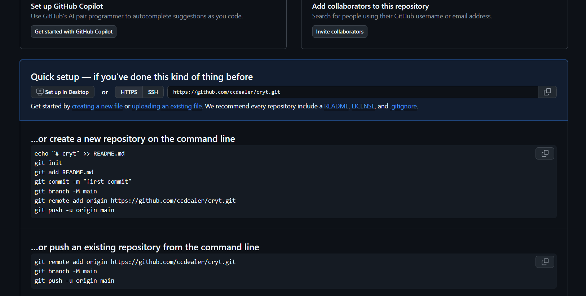

для того чтобы запустить проект вам нужно активировать вирт и написать py app.py

…or create a new repository on the command line
echo "# cryt" >> README.md
git init
git add README.md
git commit -m "first commit"
git branch -M main
git remote add origin https://github.com/ccdealer/cryt.git
git push -u origin main
…or push an existing repository from the command line
git remote add origin https://github.com/ccdealer/cryt.git
git branch -M main
git push -u origin main

https://github.com/ccdealer/cryt.git

